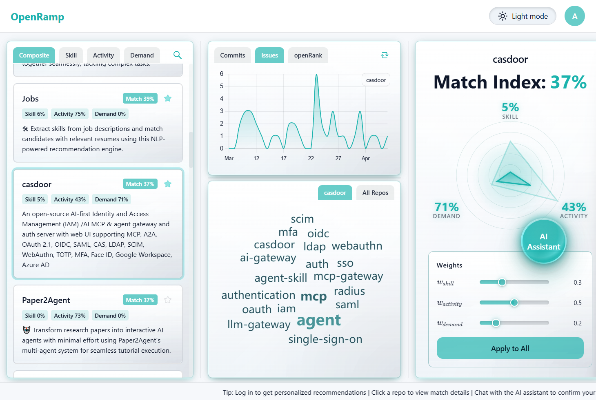
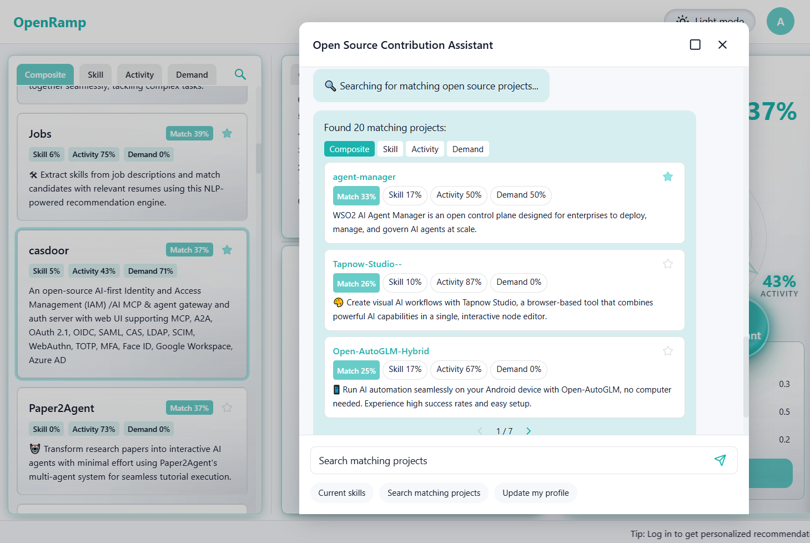

# OpenRamp

**English** · [简体中文](README.zh-CN.md)

Smooth your ramp to open source. OpenRamp combines **AI conversational profiling with multi-dimensional scoring** so you can find open-source projects that fit you better among a huge pool of repositories.





## Why Try It?

- **🗣️ Conversational Profiling**: Describe your stack and experience in natural language to generate a match-ready developer profile.
- **🎯 Smarter Matching & Insights**: Multi-signal scoring with clear reasons, plus rich visualizations to help you decide faster.
- **🔒 100% Local & Free**: Run LLMs locally with **zero token costs** and **full privacy**. No API keys, no subscriptions.

## What you can do

- **Contributors / newcomers**: map your skills and interests, search for active projects that are easier to pick up, and use radar charts to see *why* something matches
- **Maintainers / platforms**: review activity and demand signals in bulk, and use scores to steer newcomers toward repos that suit them better

## Requirements

- Python 3.10+
- Node.js 18+ and npm
- A local LLM (we recommend [Ollama](https://ollama.com/)) for chat and profiling

## Environment variables

Use a `.env` file in the project root for the backend; put frontend variables in `frontend/.env` (read by Vite).

```env
# AI (Ollama)
OLLAMA_URL=http://localhost:11434
OLLAMA_MODEL=gemma2:2b
AI_TIMEOUT=120

# GitHub (optional, higher rate limits)
GITHUB_TOKEN=your_github_token

# Backend CORS (comma-separated, default *)
CORS_ORIGINS=*

# Frontend (optional)
VITE_API_BASE=http://localhost:8000
VITE_USE_MOCK=false
```

## Quick start

**Option A: one command from the repo root (recommended)**

```bash
pip install -r requirements.txt
npm install
npm run dev
```

Starts the backend and frontend together (Python dependencies must already be installed as above). For the full stack including a local `ollama serve`:

```bash
npm run dev-all
```

**Option B: frontend only with mock API (no backend)**

```bash
cd frontend && npm install && cd ..
npm run mock
```

**Option C: run backend and frontend separately**

```bash
pip install -r requirements.txt
python -m src.api.server
# or: uvicorn src.api.server:app --host 0.0.0.0 --port 8000 --reload
```

```bash
cd frontend && npm install && npm run dev
```

- Backend (default): `http://localhost:8000`
- Frontend (dev): `http://localhost:5173`
- Production build: `cd frontend && npm run build`, then `npm run preview`

## Tech stack

- **Frontend**: React 18, Vite, TypeScript, Tailwind CSS, Axios, Chart.js / react-chartjs-2, Recharts, d3-cloud, Framer Motion, Lucide React
- **Backend**: FastAPI, Pydantic, httpx
- **AI**: Ollama integration (`OllamaProvider`), chat and multi-stage prompting
- **Data**: OpenDigger, GitHub metadata and caches

## Contributing

Thanks for helping make OpenRamp better—whether you fix a small bug, improve docs, or share an idea.

1. Fork the repo and create a branch: `git checkout -b feature/your-feature`
2. In your pull request, briefly note **what changed**, **why**, and **how you tested or verified it**

Questions first? Open an **Issue** or start a **Discussion**; we’re happy to align before you dive in.

**License:** [GPLv3](LICENSE)