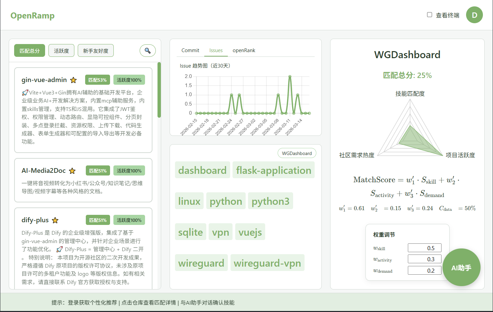
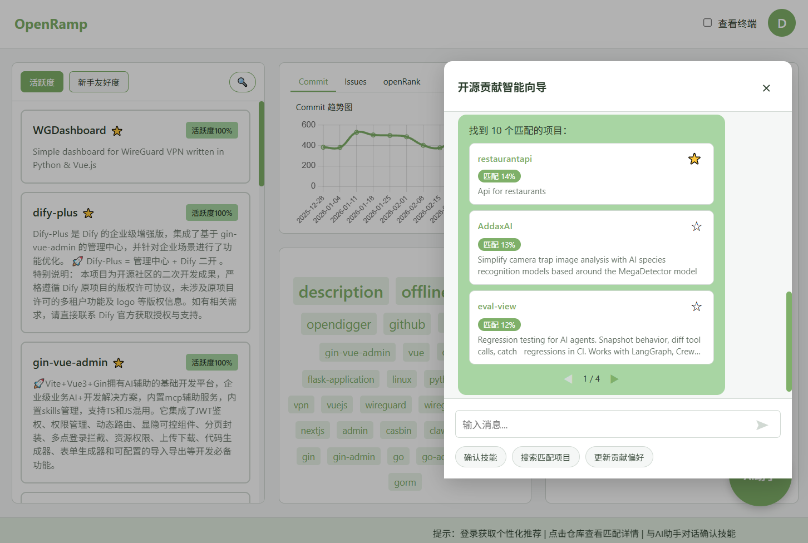

# OpenRamp · 智能开源项目匹配助手

Smooth your ramp to open source. 
OpenRamp 通过 **AI 对话画像 + 多维度数据评分**，帮你在茫茫仓库里精准找到适合自己“下手”的开源项目。





## 为什么值得一试？

- **对话式画像**：像聊天一样告诉 AI 你的技术栈、偏好、经验，自动生成开发者画像  
- **智能匹配算法**：综合技能匹配度、项目活跃度、社区需求热度，给出直观的匹配分  
- **数据驱动**：基于 GitHub API + OpenDigger 指标，结合本地缓存数据  
- **可视化体验**：包含仓库列表、时间序列趋势、词云、匹配度雷达图等多种可视化  
- **桌面级体验**：React + Electron 打包，支持桌面应用形态

## 你可以做什么？

- 作为 **开源新手**：  
  - 通过 AI 助手快速梳理自己的技能和兴趣  
  - 一键搜索“新手友好、活跃且有需求”的项目  
  - 通过雷达图理解“为什么匹配”  

- 作为 **社区维护者 / 平台方**：  
  - 批量评估候选仓库的活跃度与需求度  
  - 用匹配分引导新人流向更合适的项目  
  - 在此基础上继续集成你自己的推荐策略

---
## 快速开始

### 1. 准备环境

- Python 3.10+
- Node.js 18+
- npm
- 本地 AI 服务（推荐 [Ollama](https://ollama.com/)）

可选环境变量（在项目根目录创建 `.env`）：

```env
# AI 服务配置
OLLAMA_URL=http://localhost:11434
OLLAMA_MODEL=gemma2:2b

# GitHub Token，用于提高 API 速率限制（可选）
GITHUB_TOKEN=your_github_token
```

### 2. 启动后端（FastAPI）

```bash
pip install -r requirements.txt

# 在项目根目录
python -m src.api.server
# 或使用 uvicorn
uvicorn src.api.server:app --host 0.0.0.0 --port 8000 --reload
```

后端默认运行在：`http://localhost:8000`

### 3. 启动前端（Web / Electron）

```bash
cd frontend
npm install

# Web 开发模式
npm run dev

# Electron 桌面开发（优化中）
npm run electron:dev

# 构建前端产物（优化中）
npm run build
```

前端默认开发地址：`http://localhost:5173`

---

## 技术栈一览

- **前端**：React 18、Vite、TypeScript、Chart.js / Recharts、Electron  
- **后端**：FastAPI、Pydantic、httpx  
- **AI 层**：自研 `OllamaProvider` 封装（对话、多 Agent 提示词体系）  
- **数据层**：OpenDigger 指标离线/在线加载、GitHub 元数据缓存与补全  

---

## 参与贡献

项目仍在持续优化中，欢迎通过以下方式参与改进 OpenRamp：

1. Fork 本仓库并创建特性分支：

   ```bash
   git clone https://github.com/AVALorrie37/OpenRamp.git
   cd OpenRamp
   git checkout -b feature/your-feature-name
   ```

2. 提交 Pull Request 时，简单说明：
   - 做了什么改动
   - 解决了什么问题 / 带来了什么体验提升
   - 如何复现或验证

Issue / 讨论：请前往 GitHub 仓库的 Issues 与 Discussions 区发布。

---

**License**：GPLv3