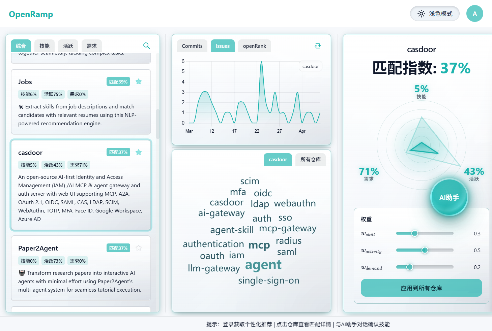
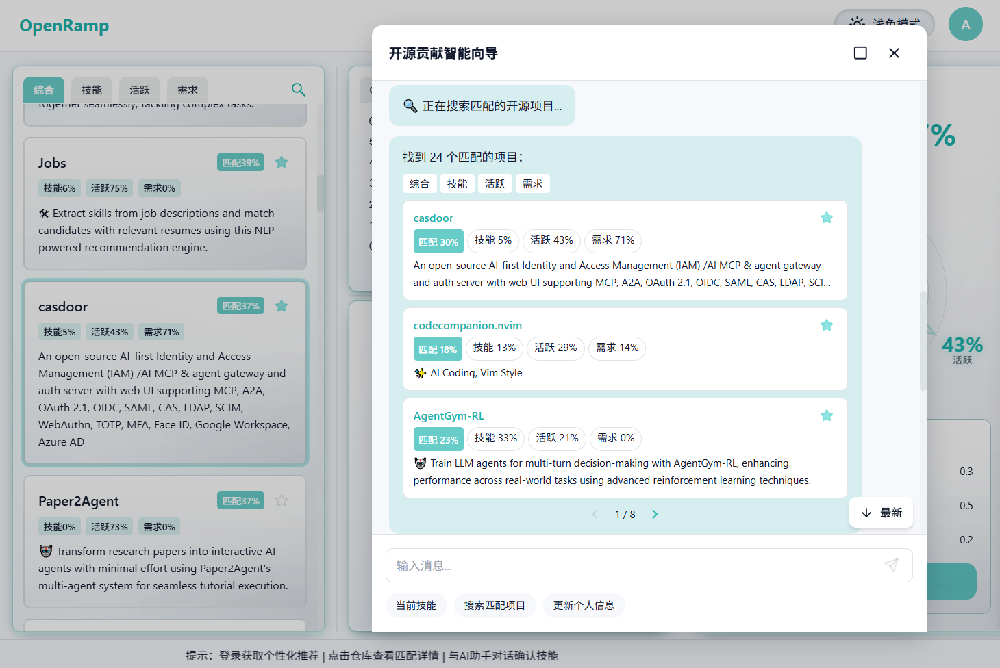

# OpenRamp

[English](README.md) · **简体中文**

Smooth your ramp to open source. OpenRamp 通过 **AI 对话画像 + 多维度数据评分**，帮你在海量仓库里找到更适合自己的开源项目。




## 为什么值得一试？

- **🗣️ 对话式画像**：用自然语言描述技术栈与经历，自动生成可用于匹配的开发者画像
- **🎯 更快更准的匹配与洞察**：基于数据做智能匹配与可视化洞察，帮你迅速找到更合适的项目/方向
- **🔒 100% 本地 & 免费**：本地运行大模型，零 token 成本，隐私完全可控；无需 API Key、无需订阅

## 你可以做什么？

- **贡献者 / 新手**：梳理技能与兴趣，搜索更易上手的活跃项目，通过雷达图了解匹配原因
- **维护者 / 平台**：批量查看活跃度与需求信号，用分数引导新人流向更合适的仓库

## 环境要求

- **本机开发：** Python 3.10+、Node.js 18+、npm。若要使用真实 AI（对话与画像，非 Mock），请安装并运行 **[Ollama](https://ollama.com/)**，并拉取模型（例如 `ollama pull gemma2:2b`）。
- **Docker 演示：** 安装 [Docker](https://docs.docker.com/get-docker/) 与 Compose —— 使用容器化方式（**方式 D**）时，本机无需单独装 Python、Node 或 Ollama。

## 环境变量

后端写在**项目根目录**的 `.env`，前端写在 **`frontend/.env`**（Vite 读取）。若与下方默认值一致，两个文件都可以不写。

```env
# AI（Ollama）—— 本机后端使用
OLLAMA_URL=http://localhost:11434
OLLAMA_MODEL=gemma2:2b
AI_TIMEOUT=120

# 可选 —— 提高 GitHub API 限额
GITHUB_TOKEN=your_github_token

# 可选 —— CORS 来源（逗号分隔；默认 *）
CORS_ORIGINS=*

# 可选 —— 本机前端（Vite）
VITE_API_BASE=http://localhost:8000
VITE_USE_MOCK=false
```

**仅 Docker：** Compose 会读取根目录 `.env`。后端容器里的 `OLLAMA_URL` 来自 **`OPENRAMP_DOCKER_OLLAMA_URL`**（默认 `http://ollama:11434`），因此 `.env` 里写成 `http://localhost:11434` 也不会把容器弄坏。若 Ollama 跑在宿主机而非 compose 里的 `ollama` 服务，请设置 `OPENRAMP_DOCKER_OLLAMA_URL=http://host.docker.internal:11434`。镜像内的前端会反向代理 `/api`，**不需要**再配 `VITE_API_BASE`。

## 快速开始

想最快跑通完整演示，用 **Docker（方式 D）**；日常在本机开发，一般用 **方式 A**。

**方式 A：根目录一键联调（本机开发推荐）**

**必做**

1. 满足上文 [环境要求](#环境要求) 中的本机开发项。
2. 在仓库根目录执行：

```bash
pip install -r requirements.txt
npm install
npm run dev
```

3. 浏览器打开 **http://localhost:5173**（前端），接口 **http://localhost:8000**。

**可选**

- **`npm run dev-all`** —— 与上面相同，并额外在同一终端启动 **`ollama serve`**（需已安装 Ollama 且在 `PATH` 中）。

**遇到问题**

- **对话或画像报错：** 确认 Ollama 已启动；用 `ollama pull` 拉取与 `OLLAMA_MODEL` 同名的模型；若地址不是默认主机/端口，检查 `OLLAMA_URL`。

**方式 B：仅前端 + Mock（不接后端）**

**必做**

```bash
cd frontend && npm install && cd ..
npm run mock
```

不接后端与 Ollama，适合只调 UI、对接 Mock API。

**方式 C：手动分两个终端**

**必做**

终端 1：

```bash
pip install -r requirements.txt
python -m src.api.server
```

终端 2：

```bash
cd frontend && npm install && npm run dev
```

**可选**

- 后端带热重载：`uvicorn src.api.server:app --host 0.0.0.0 --port 8000 --reload`
- 前端生产构建预览：`cd frontend && npm run build`，再执行 `npm run preview`

**地址：** 后端 **http://localhost:8000**，前端 **http://localhost:5173**。

**遇到问题** —— AI 相关与方式 A 相同（Ollama + 模型）。

**方式 D：Docker Compose（一键演示）**

**必做**

1. 已安装 Docker 与 Compose（如 Docker Desktop）。
2. 在仓库根目录：`docker compose up --build`
3. 浏览器打开 **http://localhost:8080**（页面走 Nginx，`/api` 会转到后端）。
4. 容器就绪后，首次拉取模型（默认 `gemma2:2b`；若改了根目录 `.env` 里的 `OLLAMA_MODEL`，名称要一致）：

```bash
docker compose exec ollama ollama pull gemma2:2b
```

**可选**

- 根目录 `.env` 配置 `GITHUB_TOKEN`、`OLLAMA_MODEL`、`CORS_ORIGINS` 等。
- Ollama 跑在宿主机、不用 compose 里的 `ollama` 服务：见 **`OPENRAMP_DOCKER_OLLAMA_URL`**（[环境变量](#环境变量)）。
- 调试：健康检查 **http://localhost:8000/health**，宿主机访问 Ollama 端口 **11434**。

**遇到问题**

- **`docker compose up` 绑定 11434 失败：** 端口被占用（常见是桌面版 Ollama）—— 退出占用程序，或改 `docker-compose.yml` 里的端口映射。
- **对话 / 提示无法连接 AI：** 先拉取模型；用 `docker compose exec ollama ollama list` 核对与 `OLLAMA_MODEL` 一致；查看 **`docker compose logs backend`**。
- **停止：** `docker compose down`。**删除数据卷**（模型与已保存仓库列表等）：`docker compose down -v`。

## 技术栈

- **前端**：React 18、Vite、TypeScript、Tailwind CSS、Axios、Chart.js / react-chartjs-2、Recharts、d3-cloud、Framer Motion、Lucide React
- **后端**：FastAPI、Pydantic、httpx
- **AI**：Ollama 封装（`OllamaProvider`）、对话与多阶段提示流程
- **数据**：OpenDigger、GitHub 元数据与缓存

## 参与贡献

感谢你愿意花时间让 OpenRamp 更好。无论是修一个小 bug、补一段文档，还是提一个新想法，都非常欢迎。

1. Fork 本仓库后新建分支：`git checkout -b feature/your-feature`
2. 提交 Pull Request 时，简单写几句：**改了什么**、**为什么改**、**怎么自测或验证**即可

有问题想先聊聊？欢迎到本仓库的 **Issues** 或 **Discussions** 发帖，我们很乐意一起把想法说清楚再动手。

**许可证：** [GPLv3](LICENSE)
